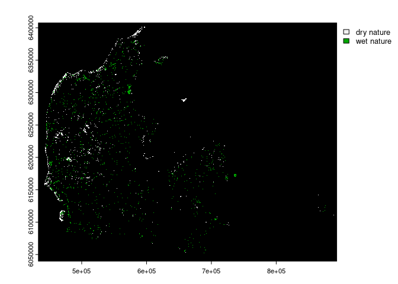

<!-- README.md is generated from README.Rmd. Please edit that file -->

# 1 SpatioTemporalCont

<!-- badges: start -->
<!-- badges: end -->

The ‘SpatioTemporalCont’ R package offers a comprehensive set of tools
for assessing both spatial and temporal continuity of land use cover.
The package is designed to analyze geospatial datasets, enabling users
to quantify the spatial arrangement of habitats within a specified
radius and track temporal changes in land use over a given time series.

For spatial continuity, the package employs a circular moving window
approach, allowing users to specify the radius of interest, such as 2000
meters. The tool calculates the proportion of each habitat within the
defined radius, providing insights into the spatial distribution of land
use cover.

In addition, ‘SpatioTemporalCont’ facilitates the analysis of temporal
continuity by evaluating how long a pixel has remained in the same land
use category over a temporal sequence. This feature is particularly
valuable for understanding the stability and persistence of land use
patterns over time.

The package’s functionality is user-friendly and integrates seamlessly
into R workflows. It builds upon existing geospatial analysis
capabilities, offering a streamlined workflow for spatial and temporal
continuity assessments. Users can leverage the package to gain valuable
insights into the dynamics of land use cover, making informed decisions
based on both spatial and temporal perspectives.

Developed with a focus on usability, ‘SpatioTemporalCont’ empowers
researchers and analysts to explore, visualize, and quantify spatial and
temporal patterns in land use data. The methods implemented in this
package draw inspiration from well-established geospatial analysis
principles, providing a robust and efficient toolkit for investigating
the spatiotemporal dynamics of land use cover.”

## 1.1 Installation

You can install the development version of SpatioTemporalCont from
[GitHub](https://github.com/) with:

``` r
# install.packages("devtools")
devtools::install_github("derek-corcoran-barrios/SpatioTemporalCont")
```

# 2 Example of use of the different functions

## 2.1 Spatial continuity

Even though there is a wrap up function that can do most of the
functionalities of spatial continuity we will go step by step to show
how they interact together, first we will show a very upscaled fragment
of the basemap 4 landuse map of Denmark, for that we will use the
included dataset `dry_wet_nature` which is a wrapped dataset

``` r
library(SpatioTemporalCont)
library(terra)
#> terra 1.7.69
## basic example code
data("dry_wet_nature")
nature <- terra::unwrap(dry_wet_nature)
```

We can see the dry nature type and wet nature type of Denmark in figure
<a href="#fig:PlotNature">2.1</a>

<div class="figure">



<p class="caption">

<span id="fig:PlotNature"></span>Figure 2.1: Areas in denmark bellonging
to dry and wet nature

</p>

</div>
