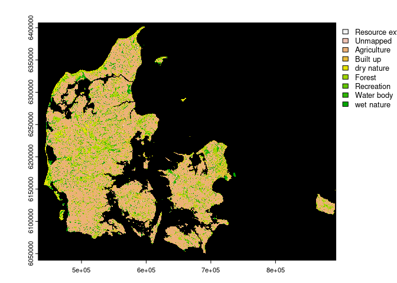

<!-- README.md is generated from README.Rmd. Please edit that file -->

# 1 SpatioTemporalCont

<!-- badges: start -->

[](https://github.com/derek-corcoran-barrios/SpatioTemporalCont/actions/workflows/R-CMD-check.yaml)
<!-- badges: end -->

The ‘SpatioTemporalCont’ R package provides a robust suite of tools for
evaluating both the spatial and temporal continuity of land use cover.
Tailored for the analysis of geospatial datasets, this package enables
users to quantify the spatial arrangement of habitats within a specified
radius and track temporal changes in land use over a given time series.

## 1.1 Spatial Continuity Analysis

For spatial continuity analysis, the package employs a circular moving
window approach, allowing users to define the radius of interest, such
as 2000 meters. The tool calculates the proportion of each habitat
within the specified radius, offering insights into the spatial
distribution of land use cover. A comprehensive wrap-up function is
available, simplifying the process and providing a holistic overview of
spatial continuity functionalities.

## 1.2 Temporal Continuity Analysis

‘SpatioTemporalCont’ also facilitates the analysis of temporal
continuity by evaluating how long a pixel has remained in the same land
use category over a temporal sequence. This feature is particularly
valuable for understanding the stability and persistence of land use
patterns over time.

## 1.3 User-Friendly Functionality

The package is designed with user-friendliness in mind, seamlessly
integrating into R workflows. It builds upon existing geospatial
analysis capabilities, offering a streamlined workflow for spatial and
temporal continuity assessments. Users can leverage the package to gain
valuable insights into the dynamics of land use cover, enabling informed
decision-making based on both spatial and temporal perspectives.

## 1.4 Installation

To install the development version of ‘SpatioTemporalCont’ from
[GitHub](https://github.com/), use the following code:

``` r
# install.packages("devtools")
devtools::install_github("derek-corcoran-barrios/SpatioTemporalCont")
```

# 2 Example of use of the different functions

## 2.1 Spatial continuity

Even though there is a wrap up function that can do most of the
functionalities of spatial continuity we will go step by step to show
how they interact together, first we will show a very upscaled fragment
of the basemap 4 landuse map of Denmark, for that we will use the
included dataset `Landuse_DK` which is a wrapped dataset

``` r
library(SpatioTemporalCont)
library(terra)
#> terra 1.7.69
## basic example code
data("Landuse_DK")
nature <- terra::unwrap(Landuse_DK)
```

We can see the dry nature type and wet nature type of Denmark in figure
<a href="#fig:PlotNature">2.1</a>

<div class="figure">



<p class="caption">

<span id="fig:PlotNature"></span>Figure 2.1: Areas in denmark bellonging
to dry and wet nature

</p>

</div>

Now we can use the `calculate_prop` to calculate the proportion of each
landuse in a certain radius, as an example we will use a radius of 200
meters to calculate the proportions of the nature raster created above,
optionally, you can decide which landuses to calculate by using the
argument `Vars`:

``` r
proportions <- calculate_prop(Rast = nature, 
                              Radius = 200, 
                              Vars = c("Agriculture", "Forest"))
#> Starting to generate dummy stack [1/3]
#> Calculating the weight matrix [2/3]
#> Generating final stack [3/3]
#> 
|---------|---------|---------|---------|
=========================================
                                          
```

We can see the result in figure <a href="#fig:propsdenmark">2.2</a>

<div class="figure">


<p class="caption">

<span id="fig:propsdenmark"></span>Figure 2.2: Prportion of different
habitat types within Denmark

</p>

</div>

## 2.2 Summarise data from polygons

This is a function that is very useful to get dataset for shapefiles,
the dataset is delivered as proportion of the chosen area that has a
particular landuse. There are three types of analysis for this: Inside
the polygons, Outside the polygon, and finally inside an outside the
polygon, in figure

``` r
data(Polygons)
data("Landuse_DK")
Landuse <- terra::unwrap(Landuse_DK)

v <- vect(Polygons, "polygons", crs = terra::crs(Landuse))
```

<div class="figure">


<p class="caption">

<span id="fig:geometries"></span>Figure 2.3: Showing the summary for
some simulated polygons inside, outside, and both

</p>

</div>

### 2.2.1 Inside the polygons

``` r
Test <- summarise_polygons(Rast = Landuse, Polygons = v,
                           Vars = c("Agriculture","Forest"))
#> Using option = inside
```

| Agriculture |    Forest |
|------------:|----------:|
|   0.6039312 | 0.2157248 |
|   0.8775385 | 0.0381538 |
|   0.5605780 | 0.2782512 |
|   0.7852426 | 0.1004881 |
|   0.7750973 | 0.0630350 |
|   0.4416529 | 0.3385124 |
|   0.7544332 | 0.0581369 |
|   0.5909091 | 0.3315508 |
|   0.3793361 | 0.3222678 |
|   0.4157738 | 0.1976190 |

<span id="tab:unnamed-chunk-3"></span>Table 2.1: Proportions for the
polygons for agriculture and forest

### 2.2.2 Inside and outside the polygon

``` r
TestBoth <- summarise_polygons(Rast = Landuse, Polygons = v,
                               Vars = c("Agriculture","Forest"), 
                               type = "Both", dist = 2500)
#> Using option = Both
```

| Agriculture |    Forest |
|------------:|----------:|
|   0.5604590 | 0.2162687 |
|   0.7971613 | 0.0568796 |
|   0.5581856 | 0.2807765 |
|   0.7598044 | 0.1049355 |
|   0.6603998 | 0.1182466 |
|   0.3187107 | 0.4529922 |
|   0.7548519 | 0.0765115 |
|   0.6477639 | 0.1825726 |
|   0.5842719 | 0.2396753 |
|   0.4760104 | 0.2141929 |

### 2.2.3 Outside the polygon

``` r
TestOut <- summarise_polygons(Rast = Landuse, 
                              Polygons = v,
                              Vars = c("Agriculture","Forest"), 
                              type = "Outside", dist = 2500)
#> Using option = Outside
```

| Agriculture |    Forest |
|------------:|----------:|
|   0.5514466 | 0.2163814 |
|   0.7826027 | 0.0604342 |
|   0.5573128 | 0.2816978 |
|   0.7483896 | 0.1069312 |
|   0.6413641 | 0.1241902 |
|   0.2710496 | 0.4973728 |
|   0.7530962 | 0.0902942 |
|   0.6531282 | 0.1685166 |
|   0.6608587 | 0.2088096 |
|   0.4951853 | 0.2332008 |
